# Padel Scoreboard App - Project Diagrams

## 1. High-Level App Flow

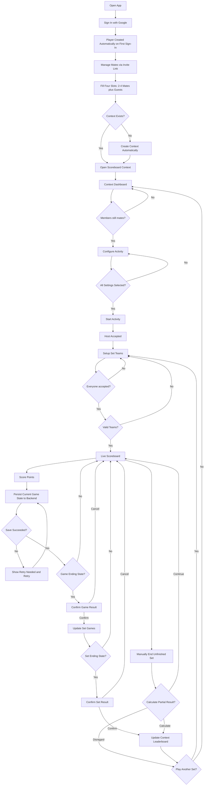
```mermaid
flowchart TD
  A[Open App] --> A1[Sign In with Google]
  A1 --> A2["Player Created Automatically on First Sign-In"]
  A2 --> B["Manage Mates via Invite Link"]
  B --> C["Fill Four Slots: 2-4 Mates plus Guests"]
  C --> D{Context Exists?}
  D -->|Yes| E[Open Scoreboard Context]
  D -->|No| F[Create Context Automatically]
  F --> E
  E --> G[Context Dashboard]
  G --> G1{Members still mates?}
  G1 -->|No| G
  G1 -->|Yes| H[Configure Activity]
  H --> I{All Settings Selected?}
  I -->|No| H
  I -->|Yes| J[Start Activity]
  J --> J1[Host Accepted]
  J1 --> K[Setup Set Teams]
  K --> K1{Everyone accepted?}
  K1 -->|No| K
  K1 -->|Yes| L{Valid Teams?}
  L -->|No| K
  L -->|Yes| M[Live Scoreboard]
  M --> N[Score Points]
  N --> N2[Persist Current Game State to Backend]
  N2 --> N3{Save Succeeded?}
  N3 -->|No| N4[Show Retry Needed and Retry]
  N4 --> N2
  N3 -->|Yes| O{Game Ending State?}
  O -->|No| M
  O -->|Yes| P[Confirm Game Result]
  P -->|Cancel| M
  P -->|Confirm| Q[Update Set Games]
  Q --> R{Set Ending State?}
  R -->|No| M
  R -->|Yes| S[Confirm Set Result]
  S -->|Cancel| M
  S -->|Confirm| T[Update Context Leaderboard]
  M --> V[Manually End Unfinished Set]
  V --> W{Calculate Partial Result?}
  W -->|Continue| M
  W -->|Disregard| U
  W -->|Calculate| T
  T --> U{Play Another Set?}
  U -->|Yes| K
  U -->|No| G
```

## 1.0 Authentication Flow

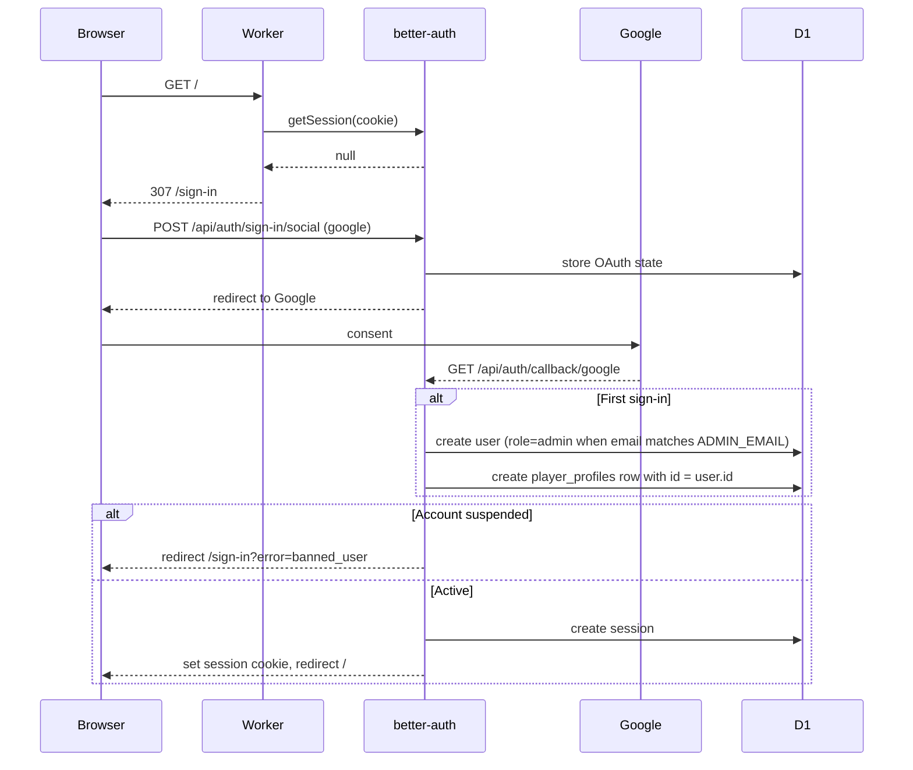
```mermaid
sequenceDiagram
  participant U as Browser
  participant W as Worker
  participant BA as better-auth
  participant G as Google
  participant D1 as D1

  U->>W: GET /
  W->>BA: getSession(cookie)
  BA-->>W: null
  W-->>U: 307 /sign-in

  U->>BA: POST /api/auth/sign-in/social (google)
  BA->>D1: store OAuth state
  BA-->>U: redirect to Google
  U->>G: consent
  G-->>BA: GET /api/auth/callback/google

  alt First sign-in
    BA->>D1: create user (role=admin when email matches ADMIN_EMAIL)
    BA->>D1: create player_profiles row with id = user.id
  end

  alt Account suspended
    BA-->>U: redirect /sign-in?error=banned_user
  else Active
    BA->>D1: create session
    BA-->>U: set session cookie, redirect /
  end
```

## 1.0.05 Player Provisioning Flow

A player is never created by hand. The hook does it at sign-up, and a defensive check on bootstrap repairs the row if the hook ever failed.

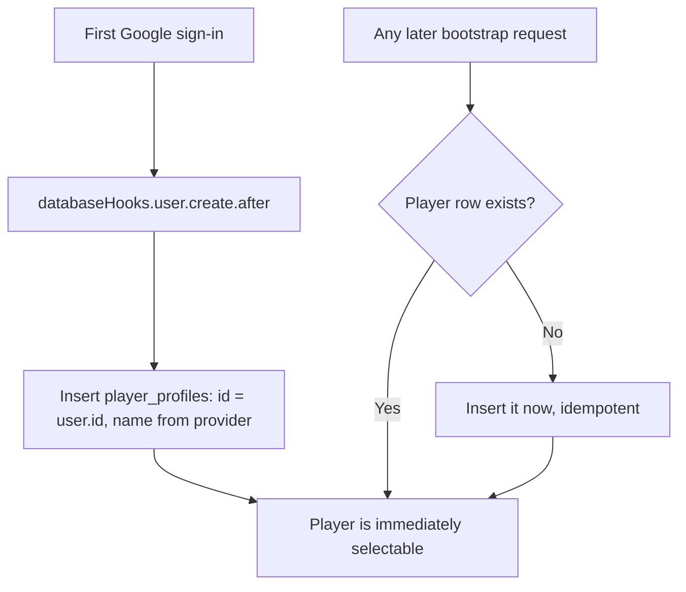
```mermaid
flowchart TD
  A["First Google sign-in"] --> B["databaseHooks.user.create.after"]
  B --> C["Insert player_profiles: id = user.id, name from provider"]
  C --> D["Player is immediately selectable"]
  E["Any later bootstrap request"] --> F{"Player row exists?"}
  F -->|Yes| D
  F -->|No| G["Insert it now, idempotent"]
  G --> D
```

## 1.0.06 Mate Invite Flow

There is no user search. A link shared directly is the only route to becoming mates. An unused invite is valid for 30 minutes from creation. The inviter can delete an unused invite; an already-accepted invite cannot be deleted. Opening the Mates screen fetches the current list and any unused unexpired invite; Refresh on that screen runs the same fetch. The inviter shares from the same dialog as activity share. There is no background poll.

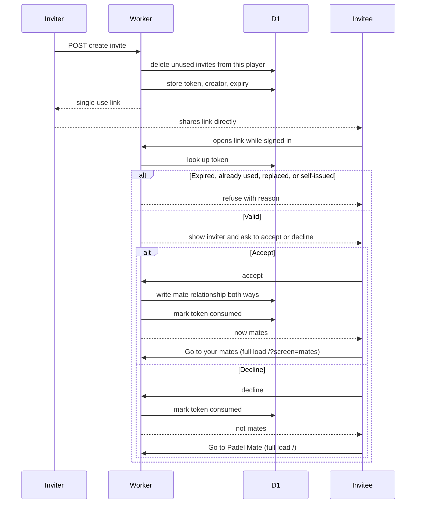
```mermaid
sequenceDiagram
  participant A as Inviter
  participant W as Worker
  participant D1 as D1
  participant B as Invitee

  A->>W: POST create invite
  W->>D1: delete unused invites from this player
  W->>D1: store token, creator, expiry
  W-->>A: single-use link
  A-->>B: shares link directly

  B->>W: opens link while signed in
  W->>D1: look up token

  alt Expired, already used, replaced, or self-issued
    W-->>B: refuse with reason
  else Valid
    W-->>B: show inviter and ask to accept or decline
    alt Accept
      B->>W: accept
      W->>D1: write mate relationship both ways
      W->>D1: mark token consumed
      W-->>B: now mates
      B->>W: Go to your mates (full load /?screen=mates)
    else Decline
      B->>W: decline
      W->>D1: mark token consumed
      W-->>B: not mates
      B->>W: Go to Padel Mate (full load /)
    end
  end
```

## 1.0.1 Account Suspension Flow

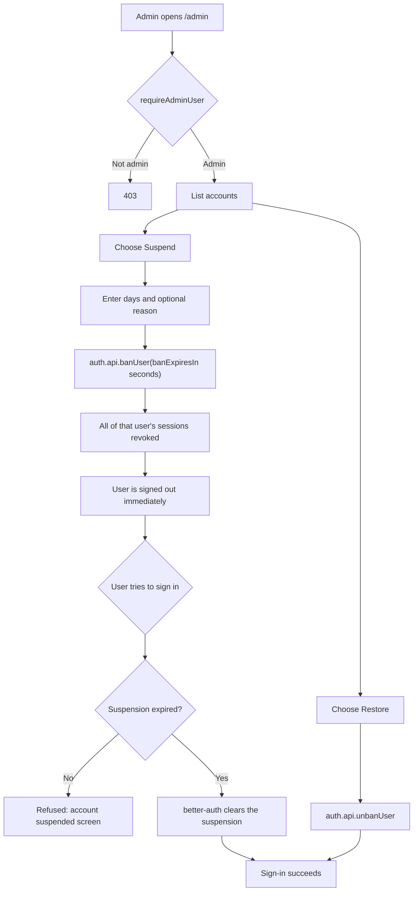
```mermaid
flowchart TD
  A[Admin opens /admin] --> B{requireAdminUser}
  B -->|Not admin| C[403]
  B -->|Admin| D[List accounts]
  D --> E[Choose Suspend]
  E --> F[Enter days and optional reason]
  F --> G["auth.api.banUser(banExpiresIn seconds)"]
  G --> H[All of that user's sessions revoked]
  H --> I[User is signed out immediately]
  I --> J{User tries to sign in}
  J --> K{Suspension expired?}
  K -->|No| L[Refused: account suspended screen]
  K -->|Yes| M[better-auth clears the suspension]
  M --> N[Sign-in succeeds]
  D --> O[Choose Restore]
  O --> P["auth.api.unbanUser"]
  P --> N
```

## 1.0.2 Deployment Flow

Promotion is one-way: feature → `main` → `development` → `production`. Pull requests into `development` or `production` run CI first. Requiring `CI / check` on those branches is a GitHub ruleset setting. Push to `production` still deploys. Do not merge `production` or `development` back into `main`.

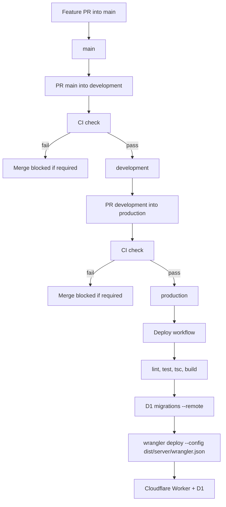
```mermaid
flowchart TD
  F[Feature PR into main] --> M[main]
  M --> P1[PR main into development]
  P1 --> C1[CI check]
  C1 -->|fail| D1[Merge blocked if required]
  C1 -->|pass| Dev[development]
  Dev --> P2[PR development into production]
  P2 --> C2[CI check]
  C2 -->|fail| D2[Merge blocked if required]
  C2 -->|pass| Prod[production]
  Prod --> G[Deploy workflow]
  G --> H[lint, test, tsc, build]
  H --> I[D1 migrations --remote]
  I --> J["wrangler deploy --config dist/server/wrangler.json"]
  J --> K[Cloudflare Worker + D1]
```

## 1.1 Reload Recovery Flow

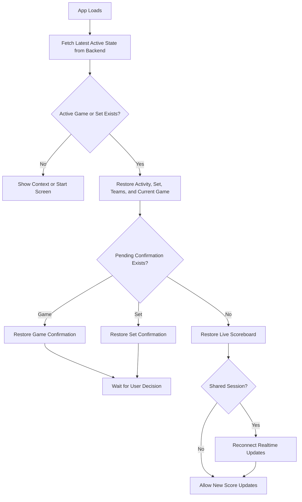
```mermaid
flowchart TD
  A[App Loads] --> B[Fetch Latest Active State from Backend]
  B --> C{Active Game or Set Exists?}
  C -->|No| D[Show Context or Start Screen]
  C -->|Yes| E[Restore Activity, Set, Teams, and Current Game]
  E --> F{Pending Confirmation Exists?}
  F -->|Game| G[Restore Game Confirmation]
  F -->|Set| H[Restore Set Confirmation]
  F -->|No| I[Restore Live Scoreboard]
  G --> J[Wait for User Decision]
  H --> J
  I --> K{Shared Session?}
  K -->|Yes| L[Reconnect Realtime Updates]
  K -->|No| M[Allow New Score Updates]
  L --> M
```

## 1.2 Shared Session Join Flow

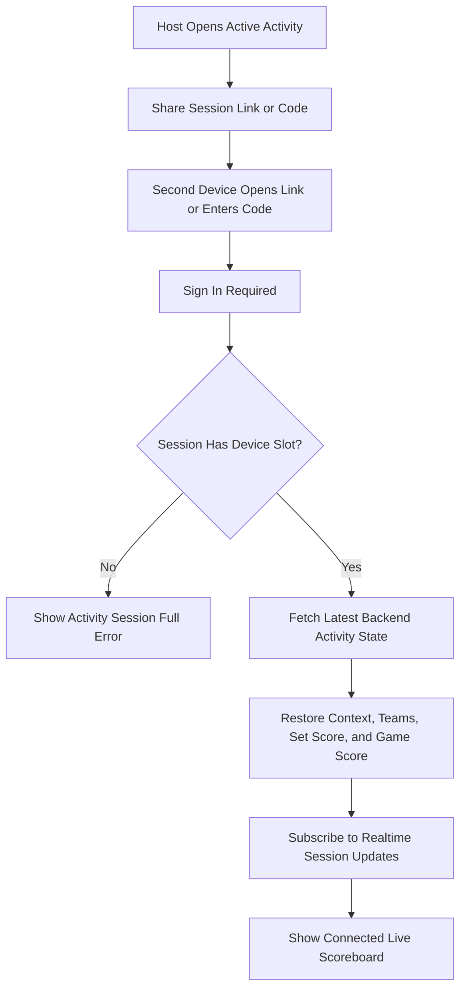
```mermaid
flowchart TD
  A[Host Opens Active Activity] --> B[Share Session Link or Code]
  B --> C[Second Device Opens Link or Enters Code]
  C --> D[Sign In Required]
  D --> E{Session Has Device Slot?}
  E -->|No| F[Show Activity Session Full Error]
  E -->|Yes| G[Fetch Latest Backend Activity State]
  G --> H[Restore Context, Teams, Set Score, and Game Score]
  H --> I[Subscribe to Realtime Session Updates]
  I --> J[Show Connected Live Scoreboard]
```

## 1.3 Activity Session Slot Lifecycle

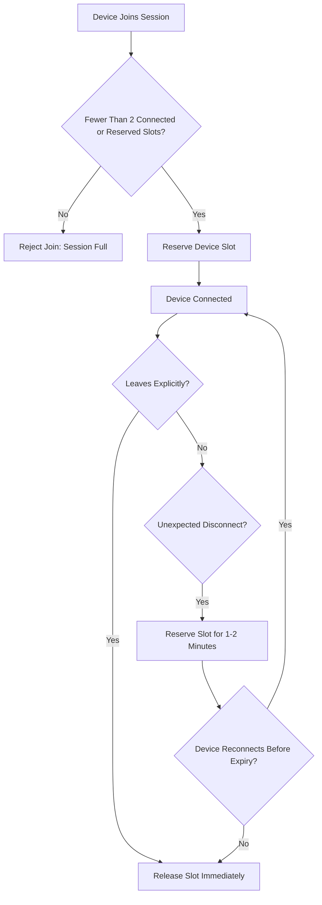
```mermaid
flowchart TD
  A[Device Joins Session] --> B{Fewer Than 2 Connected or Reserved Slots?}
  B -->|No| C[Reject Join: Session Full]
  B -->|Yes| D[Reserve Device Slot]
  D --> E[Device Connected]
  E --> F{Leaves Explicitly?}
  F -->|Yes| G[Release Slot Immediately]
  F -->|No| H{Unexpected Disconnect?}
  H -->|Yes| I[Reserve Slot for 1-2 Minutes]
  I --> J{Device Reconnects Before Expiry?}
  J -->|Yes| E
  J -->|No| G
```

## 1.4 Abandoned Session Flow

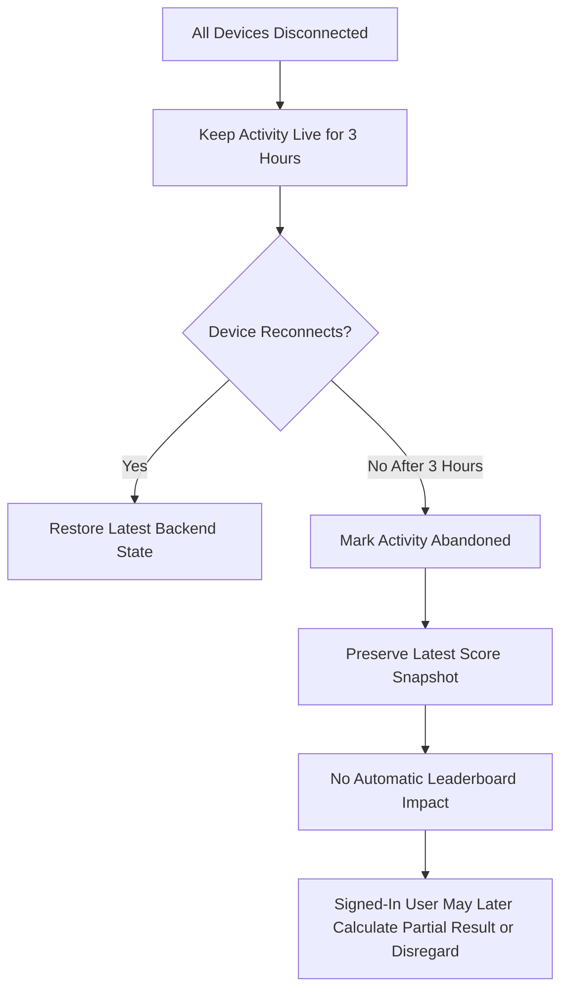
```mermaid
flowchart TD
  A[All Devices Disconnected] --> B[Keep Activity Live for 3 Hours]
  B --> C{Device Reconnects?}
  C -->|Yes| D[Restore Latest Backend State]
  C -->|No After 3 Hours| E[Mark Activity Abandoned]
  E --> F[Preserve Latest Score Snapshot]
  F --> G[No Automatic Leaderboard Impact]
  G --> H[Signed-In User May Later Calculate Partial Result or Disregard]
```

## 2. Context Identification Flow

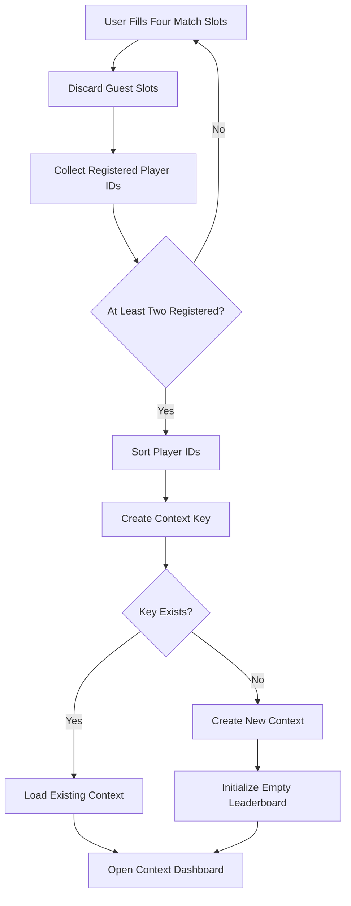
```mermaid
flowchart TD
  A["User Fills Four Match Slots"] --> A1["Discard Guest Slots"]
  A1 --> B["Collect Registered Player IDs"]
  B --> B1{"At Least Two Registered?"}
  B1 -->|No| A
  B1 -->|Yes| C[Sort Player IDs]
  C --> D[Create Context Key]
  D --> E{Key Exists?}
  E -->|Yes| F[Load Existing Context]
  E -->|No| G[Create New Context]
  G --> H[Initialize Empty Leaderboard]
  F --> I[Open Context Dashboard]
  H --> I
```

## 2.1 Context Dashboard Sync

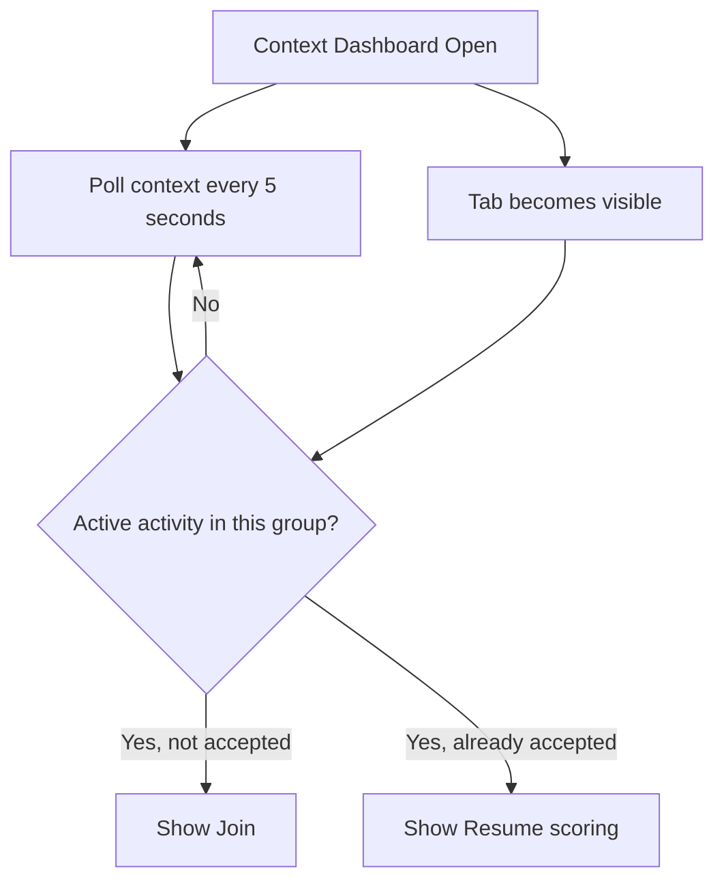
```mermaid
flowchart TD
  A[Context Dashboard Open] --> B[Poll context every 5 seconds]
  A --> C[Tab becomes visible]
  B --> D{Active activity in this group?}
  C --> D
  D -->|No| B
  D -->|Yes, not accepted| E[Show Join]
  D -->|Yes, already accepted| F[Show Resume scoring]
```

## 3. Activity Configuration Flow

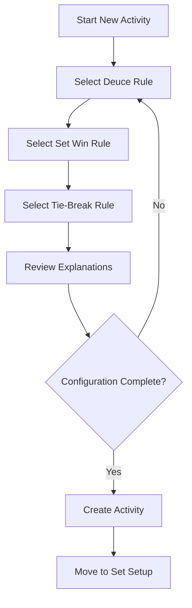
```mermaid
flowchart TD
  A[Start New Activity] --> B[Select Deuce Rule]
  B --> C[Select Set Win Rule]
  C --> D[Select Tie-Break Rule]
  D --> E[Review Explanations]
  E --> F{Configuration Complete?}
  F -->|No| B
  F -->|Yes| G[Create Activity]
  G --> H[Move to Set Setup]
```

## 4. Scoring State Machine

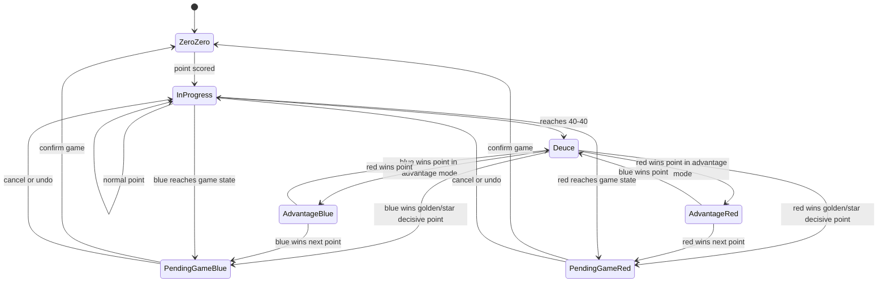
```mermaid
stateDiagram-v2
  [*] --> ZeroZero
  ZeroZero --> InProgress: point scored
  InProgress --> InProgress: normal point
  InProgress --> Deuce: reaches 40-40
  Deuce --> AdvantageBlue: blue wins point in advantage mode
  Deuce --> AdvantageRed: red wins point in advantage mode
  Deuce --> PendingGameBlue: blue wins golden/star decisive point
  Deuce --> PendingGameRed: red wins golden/star decisive point
  AdvantageBlue --> PendingGameBlue: blue wins next point
  AdvantageBlue --> Deuce: red wins point
  AdvantageRed --> PendingGameRed: red wins next point
  AdvantageRed --> Deuce: blue wins point
  InProgress --> PendingGameBlue: blue reaches game state
  InProgress --> PendingGameRed: red reaches game state
  PendingGameBlue --> ZeroZero: confirm game
  PendingGameRed --> ZeroZero: confirm game
  PendingGameBlue --> InProgress: cancel or undo
  PendingGameRed --> InProgress: cancel or undo
```

## 5. Star Point Flow

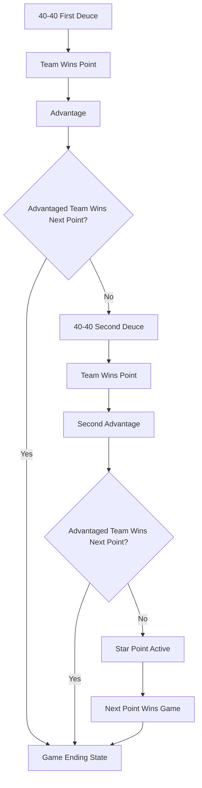
```mermaid
flowchart TD
  A[40-40 First Deuce] --> B[Team Wins Point]
  B --> C[Advantage]
  C --> D{Advantaged Team Wins Next Point?}
  D -->|Yes| E[Game Ending State]
  D -->|No| F[40-40 Second Deuce]
  F --> G[Team Wins Point]
  G --> H[Second Advantage]
  H --> I{Advantaged Team Wins Next Point?}
  I -->|Yes| E
  I -->|No| J[Star Point Active]
  J --> K[Next Point Wins Game]
  K --> E
```

## 6. Set Completion Flow

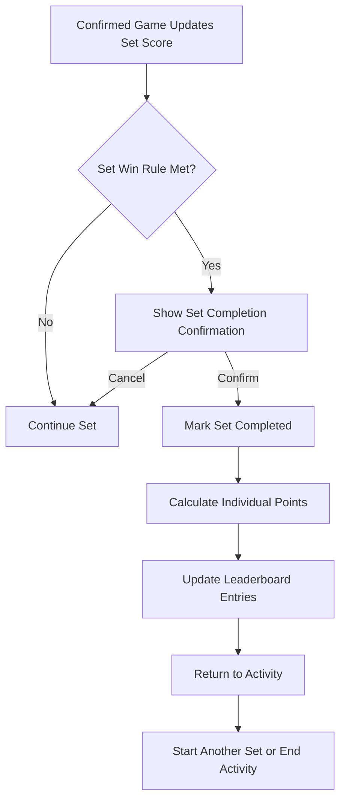
```mermaid
flowchart TD
  A[Confirmed Game Updates Set Score] --> B{Set Win Rule Met?}
  B -->|No| C[Continue Set]
  B -->|Yes| D[Show Set Completion Confirmation]
  D -->|Cancel| C
  D -->|Confirm| E[Mark Set Completed]
  E --> F[Calculate Individual Points]
  F --> G[Update Leaderboard Entries]
  G --> H[Return to Activity]
  H --> I[Start Another Set or End Activity]
```

## 6.1 Manual Early Set Conclusion Flow

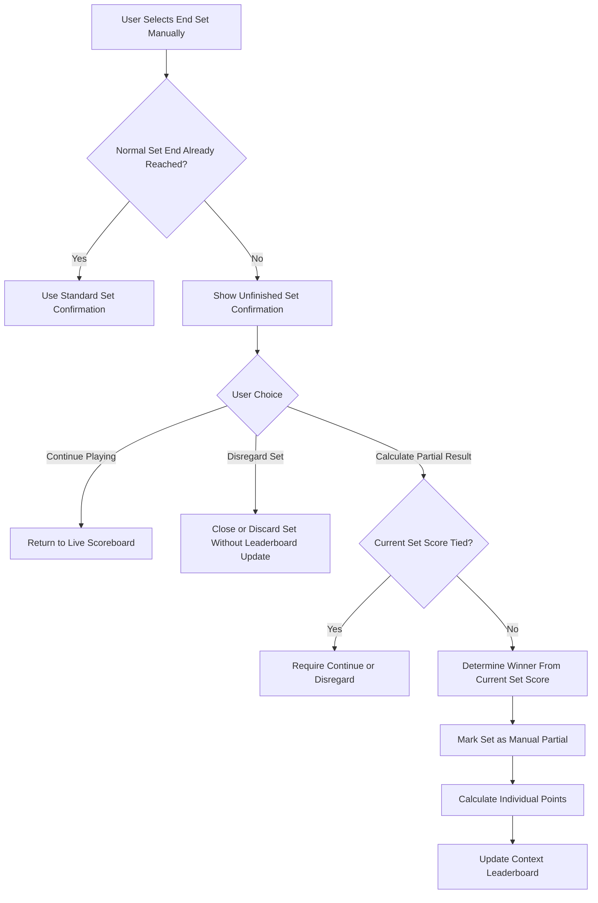
```mermaid
flowchart TD
  A[User Selects End Set Manually] --> B{Normal Set End Already Reached?}
  B -->|Yes| C[Use Standard Set Confirmation]
  B -->|No| D[Show Unfinished Set Confirmation]
  D --> E{User Choice}
  E -->|Continue Playing| F[Return to Live Scoreboard]
  E -->|Disregard Set| G[Close or Discard Set Without Leaderboard Update]
  E -->|Calculate Partial Result| H{Current Set Score Tied?}
  H -->|Yes| I[Require Continue or Disregard]
  H -->|No| J[Determine Winner From Current Set Score]
  J --> K[Mark Set as Manual Partial]
  K --> L[Calculate Individual Points]
  L --> M[Update Context Leaderboard]
```

## 6.2 Backend Score Persistence Flow

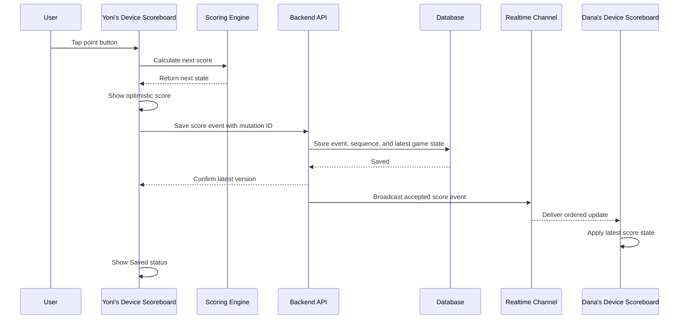
```mermaid
sequenceDiagram
  participant User
  participant UI as Yoni's Device Scoreboard
  participant Engine as Scoring Engine
  participant API as Backend API
  participant DB as Database
  participant RT as Realtime Channel
  participant UI2 as Dana's Device Scoreboard

  User->>UI: Tap point button
  UI->>Engine: Calculate next score
  Engine-->>UI: Return next state
  UI->>UI: Show optimistic score
  UI->>API: Save score event with mutation ID
  API->>DB: Store event, sequence, and latest game state
  DB-->>API: Saved
  API-->>UI: Confirm latest version
  API->>RT: Broadcast accepted score event
  RT-->>UI2: Deliver ordered update
  UI2->>UI2: Apply latest score state
  UI->>UI: Show Saved status
```

## 6.3 Current-Game History Flow

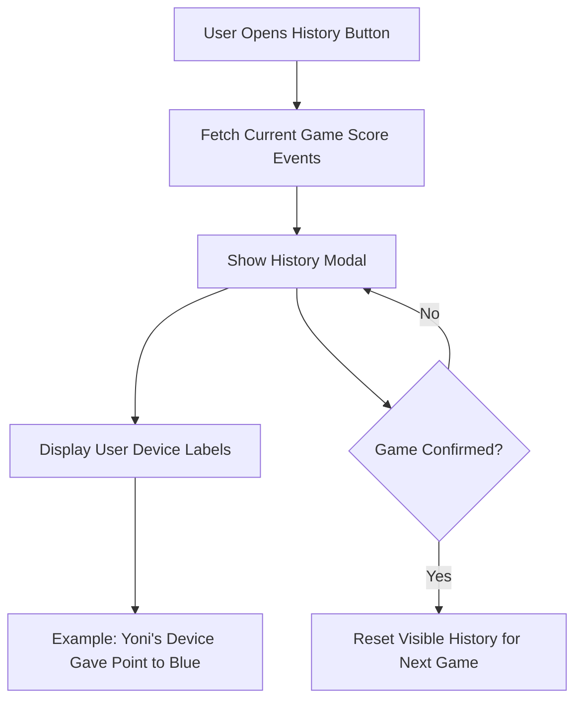
```mermaid
flowchart TD
  A[User Opens History Button] --> B[Fetch Current Game Score Events]
  B --> C[Show History Modal]
  C --> D[Display User Device Labels]
  D --> E[Example: Yoni's Device Gave Point to Blue]
  C --> F{Game Confirmed?}
  F -->|Yes| G[Reset Visible History for Next Game]
  F -->|No| C
```

## 6.4 Backend Retry and Idempotency Flow

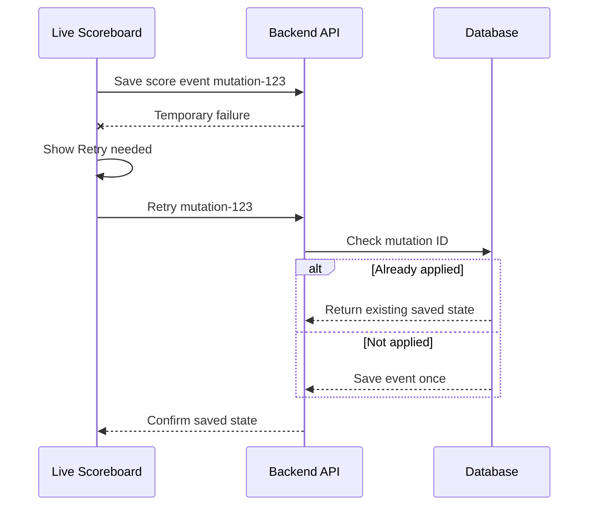
```mermaid
sequenceDiagram
  participant UI as Live Scoreboard
  participant API as Backend API
  participant DB as Database

  UI->>API: Save score event mutation-123
  API--xUI: Temporary failure
  UI->>UI: Show Retry needed
  UI->>API: Retry mutation-123
  API->>DB: Check mutation ID
  alt Already applied
    DB-->>API: Return existing saved state
  else Not applied
    DB-->>API: Save event once
  end
  API-->>UI: Confirm saved state
```

## 7. Data Relationship Diagram

```mermaid
erDiagram
  USER ||--|| PLAYER : shares_id_with
  USER ||--o{ ACTIVITY_SESSION_PARTICIPANT : joins
  USER ||--o{ GAME_EVENT : creates
  PLAYER ||--o{ MATE : has
  PLAYER ||--o{ MATE_INVITE : issues
  PLAYER ||--o{ SCOREBOARD_CONTEXT_PLAYER : participates_in
  SCOREBOARD_CONTEXT ||--o{ SCOREBOARD_CONTEXT_PLAYER : contains
  SCOREBOARD_CONTEXT ||--o{ ACTIVITY : owns
  SCOREBOARD_CONTEXT ||--o{ LEADERBOARD_ENTRY : ranks
  SCOREBOARD_CONTEXT ||--o{ SET_LOG_ENTRY : retains
  ACTIVITY ||--o{ SET_RECORD : contains
  ACTIVITY ||--o{ ACTIVITY_SESSION_PARTICIPANT : has
  ACTIVITY ||--o{ ACTIVITY_CONSENT : records
  ACTIVITY ||--o{ SET_LOG_ENTRY : logs
  PLAYER ||--o{ ACTIVITY_CONSENT : accepts
  SET_RECORD ||--o{ GAME_EVENT : records
  SET_RECORD ||--o{ CURRENT_GAME : has
  PLAYER ||--o{ LEADERBOARD_ENTRY : has

  USER {
    string id
    string name
    string email
    string role
    boolean banned
    string banExpires
    string createdAt
  }

  PLAYER {
    string id
    string name
    string createdAt
  }

  MATE {
    string playerId
    string matePlayerId
    string createdAt
  }

  MATE_INVITE {
    string token
    string createdByPlayerId
    string createdAt
    string expiresAt
    string consumedAt
    string consumedByPlayerId
  }

  SCOREBOARD_CONTEXT {
    string id
    string contextKey
    string createdAt
  }

  SCOREBOARD_CONTEXT_PLAYER {
    string contextId
    string playerId
  }

  ACTIVITY {
    string id
    string contextId
    int activityNumber
    string deuceRule
    string setWinRule
    string tieBreakRule
    string pointsFormula
    string status
    string createdByUserId
    string shareCode
    string shareUrl
    int maxConnectedDevices
    string allDevicesDisconnectedAt
    string abandonedAt
    string abandonmentSnapshotId
    string startedAt
    string endedAt
  }

  ACTIVITY_CONSENT {
    string activityId
    string playerId
    string acceptedAt
  }

  ACTIVITY_SESSION_PARTICIPANT {
    string id
    string activityId
    string userId
    string deviceId
    string userDisplayName
    string deviceLabel
    string role
    string connectionStatus
    string slotStatus
    string slotReservedUntil
    string joinedAt
    string lastSeenAt
    string leftAt
  }

  SET_RECORD {
    string id
    string activityId
    string blueSlotId1
    string blueSlotId2
    string redSlotId1
    string redSlotId2
    int blueGames
    int redGames
    string status
    string winnerTeam
    string conclusionType
    string disregardedAt
    string completedAt
  }

  GAME_EVENT {
    string id
    string setId
    string currentGameId
    string team
    string previousScore
    string nextScore
    string clientMutationId
    string createdByDeviceId
    string createdByUserId
    string userDisplayName
    string deviceLabel
    int sequenceNumber
    string createdAt
  }

  SET_LOG_ENTRY {
    string id
    string contextId
    string activityId
    int activityNumber
    string activityDate
    string setId
    int blueGames
    int redGames
    string winnerTeam
    string conclusionType
    string createdAt
  }

  CURRENT_GAME {
    string id
    string setId
    string blueScore
    string redScore
    int deuceReturnCount
    boolean decisivePointActive
    string pendingWinnerTeam
    int version
    string lastSavedAt
  }

  LEADERBOARD_ENTRY {
    string contextId
    string playerId
    int totalPoints
    int setsPlayed
    int setsWon
    int setsLost
    int gamesWon
    int gamesLost
    int gameDifferential
  }
```

## 8. Component Relationship Diagram

```mermaid
flowchart LR
  AA[Sign-In Screen] --> A["My Padel Mates Screen"]
  AA --> AD[Admin Accounts Screen]
  AD --> AS
  A --> B[Context Selector]
  B --> C[Context Dashboard]
  C --> D[Activity Configuration]
  D --> E[Set Setup]
  E --> F[Live Scoreboard]
  F --> G[Confirmation Dialogs]
  F --> S[Current Game History Modal]
  F --> H[Scoring Engine]
  F --> M[Save Status Indicator]
  F --> O[Connection Status Indicator]
  F --> N[Backend API Client]
  F --> P[Realtime Session Client]
  C --> I[Leaderboard View]
  C --> Q[Last 5 Activity Logs]
  E --> R[Current Activity Set Log]
  H --> J[Leaderboard Engine]
  J --> I
  B --> K[Context Engine]
  AA --> AS[better-auth]
  A --> L[Persistence Layer]
  K --> L
  H --> L
  J --> L
  N --> L
  P --> L
  AS --> L
```

## 8.1 Live Scoreboard Responsive Layout

```mermaid
flowchart TD
  A[Live Scoreboard] --> B{Device Orientation}
  B -->|Portrait| C[Vertical Team Layout]
  B -->|Landscape| D[Side-by-Side Team Layout]
  C --> E[Large Scores Remain Primary]
  C --> F[Touch Controls Near Bottom]
  D --> G[Large Side-by-Side Score Panels]
  D --> H[Controls Stay Accessible]
  E --> I[Same Active Game State]
  F --> I
  G --> I
  H --> I
```

## 9. Recommended First Implementation Slice

```mermaid
flowchart TD
  A["Sign In, Player Auto-Created"] --> B["Invite Mates by Link"]
  B --> C["Fill Four Slots: 2-4 Mates plus Guests"]
  C --> D[Create or Open Context]
  D --> E[Configure Activity]
  E --> F[Select Teams]
  F --> G[Share Session]
  G --> H[Score One Set]
  H --> I[Confirm Set]
  I --> J[Update Leaderboard]
```
